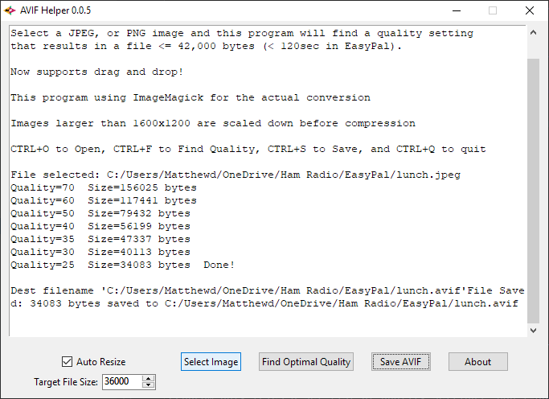

# AVIF Helper

Super basic Python UI for compressing a JPEG/PNG to AVIF at a target size.

There is nothing clever here.  It just uses ImageMagick to try a few quality settings and picks the one under the 
specified goal size.  Will resize large images to somewhere around 1600x1200.

It's meant to be super simple.  If you want the best quality then use [https://squoosh.app/](Squoosh).  It's amazing.

Windows only (Uses Windows API for spawning processes correctly from a frozen TK program).  

**Does** correctly freeze to a single 17MB exe (including `magick.exe` binary).




## Issues

No thread when launching `magick` so the UI will freeze while it's compressing the image.  There's also no way to 
stop it (without closing the program).

The 42Kb target is hardcoded.

Program only tries a set list of quality settings, can't adapt to results and make finer adjustments

No drag and drop for opening images.


## Icon

Stolen from The Alliance for Open Media 

```
Copyright © 2019 The Alliance for Open Media
Redistribution and use in source and binary forms, with or without modification, are permitted provided 
that the following conditions are met:

Redistributions of source code must retain the above copyright notice, this list of conditions and the 
following disclaimer.

Redistributions in binary form must reproduce the above copyright notice, this list of conditions and 
the following disclaimer in the documentation and/or other materials provided with the distribution.

Neither the name of The Alliance for Open Media nor the names of its contributors may be used to endorse 
or promote products derived from this software without specific prior written permission.

THIS SOFTWARE IS PROVIDED BY THE ALLIANCE FOR OPEN MEDIA "AS IS" AND ANY EXPRESS OR IMPLIED WARRANTIES, 
INCLUDING, BUT NOT LIMITED TO, THE IMPLIED WARRANTIES OF MERCHANTABILITY AND FITNESS FOR A PARTICULAR 
PURPOSE ARE DISCLAIMED. IN NO EVENT SHALL THE ALLIANCE FOR OPEN MEDIA BE LIABLE FOR ANY DIRECT, INDIRECT, 
INCIDENTAL, SPECIAL, EXEMPLARY, OR CONSEQUENTIAL DAMAGES (INCLUDING, BUT NOT LIMITED TO, PROCUREMENT OF 
SUBSTITUTE GOODS OR SERVICES; LOSS OF USE, DATA, OR PROFITS; OR BUSINESS INTERRUPTION) HOWEVER CAUSED AND 
ON ANY THEORY OF LIABILITY, WHETHER IN CONTRACT, STRICT LIABILITY, OR TORT (INCLUDING NEGLIGENCE OR 
OTHERWISE) ARISING IN ANY WAY OUT OF THE USE OF THIS SOFTWARE, EVEN IF ADVISED OF THE POSSIBILITY OF SUCH 
DAMAGE.
```